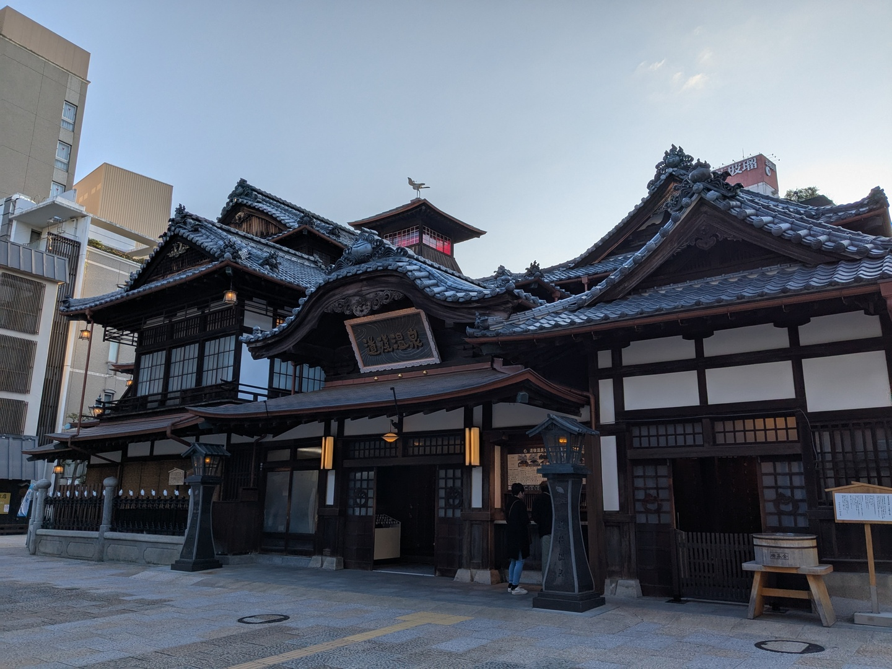
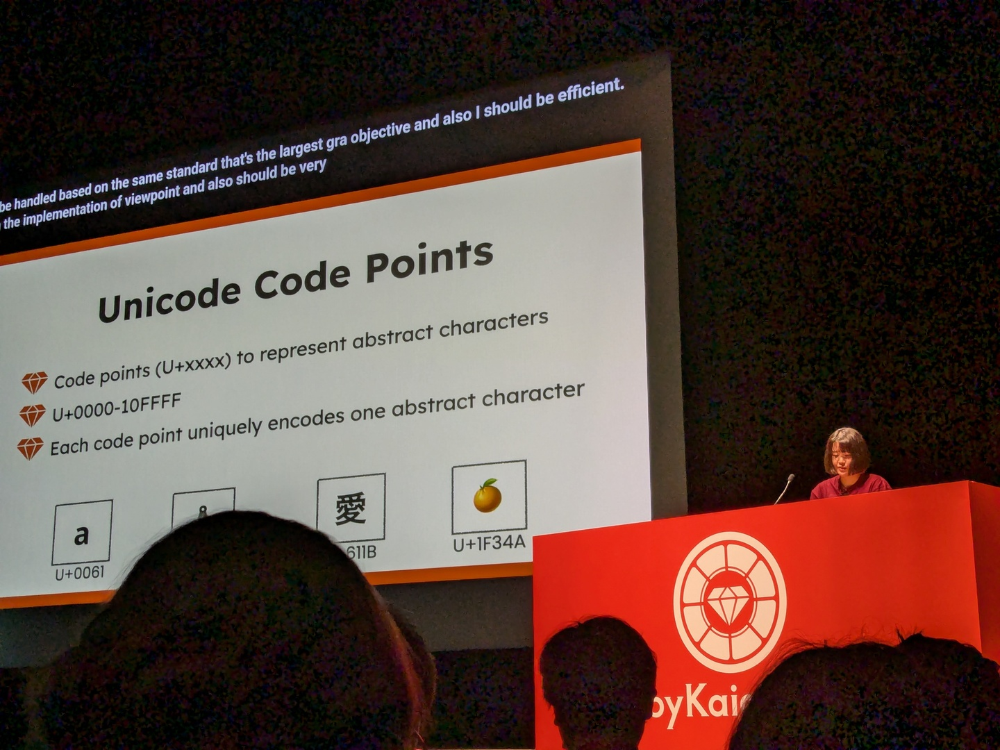

# RubyKaigi 2025のLTで時間切れになった話

Shugo Maeda  
Network Applied Communication Laboratory Ltd.

## RubyKaigi 2025に行ってきました

## 初日キーノート

## LT

* Displaying "アパート" correctly on Textbringer
  * 主にUnicodeの結合文字の扱いについて

## 時間切れ

* 32ページ中10ページくらいは話せず終了

## Rubyistに伝えたかったLTの歴史と大事なこと

* https://note.com/kkd/n/n9edb3418805e

> 5分だから失敗しても大した事ない

> 自分はこの5分、全力で情熱を出し切っただろうか？

## ハングル

* 朝鮮語を表記するための表音文字
* 1443年に李氏朝鮮第4代国王の世宗が訓民正音を公布

## 音素文字

* 音素(母音や子音)が表記の単位になっている文字体系

## 音節文字

* ひとつひとつの文字が音節(母音と子音の組合せからなる)を表す文字体系

## ハングル字母

* 音素(母音や子音)を表す
* 例: ㅎ(h)、ㅏ(a)

## ハングル音節文字

* 音節を表す
* 2つ(子音+母音)または3つ(子音+母音)の字母により構成される
  * 初声の子音
  * 中声の母音
  * 終声の子音
* 例: ᄒ + ᅡ = 하 (ha), ᄒ + ᅡ + ᆫ = 한 (han)

## Unicodeのハングル字母とハングル互換字母

* ハングル字母 (U+1100..U+11FF)
  * 合成可能(結合文字ではない)
  * 初声と終声の子音に別のコードポイントを割り当て
* ハングル互換字母 (U+3130..U+318F)
  * 合成不可
  * 初声と終声の子音に同じコードポイントを割り当て
    * 初声か終声かは文脈による

## 合成の例

* 한 = U+1112(ᄒ) U+1161(ᅡ) U+11AB(ᆫ)
  * ハングル字母ブロックの文字は合成される
* ㅎㅏㄴ = U+314E(ㅎ) U+314F(ㅏ) U+3134(ㄴ)
  * ハングル互換字母ブロックの文字は合成されない

## Textbringer上での表示

* ハングル字母の合成が可能な場合はNFC正規化で音節文字に変換
* cursesや端末で文字幅(に付随してカーソル位置)の計算が狂わないように

## Textbringer上での入力

* 組み込みの入力メソッドを提供
  * C-u C-\ hangul RET

## 2-Set Korean

* ハングル互換字母を入力して組み合わせる
  * 初声と終声で同じキーを使い回すので使用するキーが少なくてすむ
* 例: ㅎ(g) ㅏ(k) ㄴ(s) → 한

## デモ
